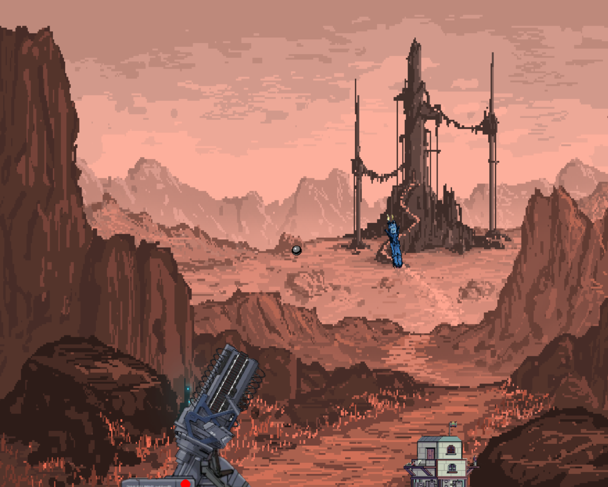
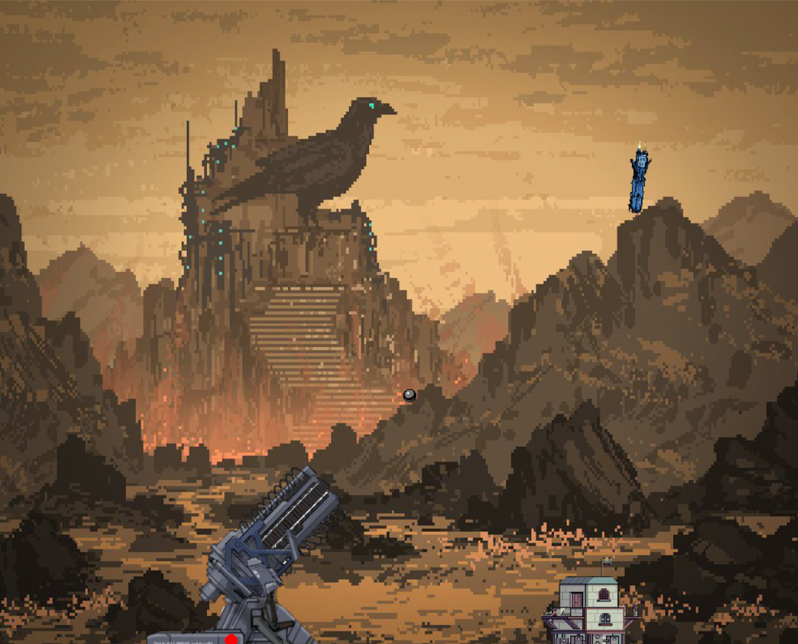
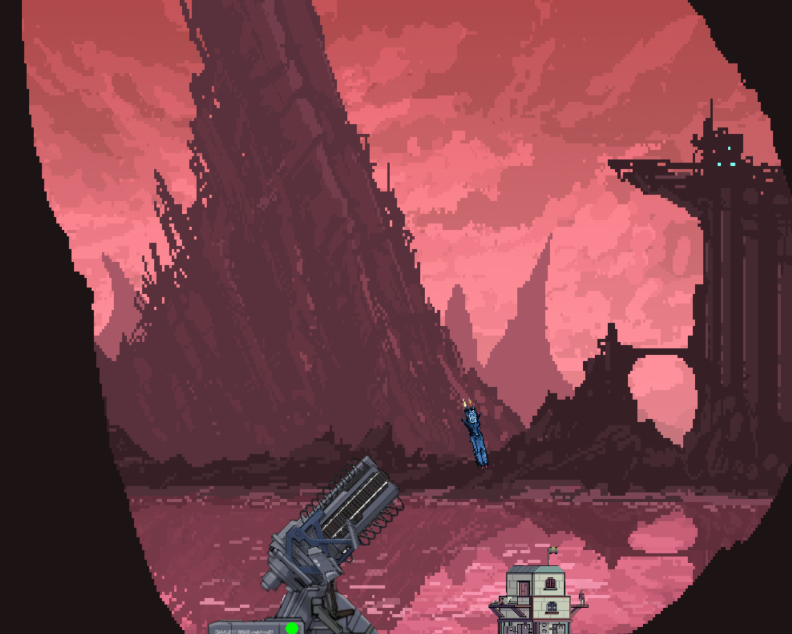

# Air Defence System Simulation

---
## Description

This project is a game designed to teach Pygame, simulate object motion, and predict their coordinates for interception. The game simulates the operation of an air defense system (ADS) protecting a ground object from missile attacks. The system includes a radar that detects airborne targets and a gun that fires projectiles to intercept them.

### Key Features:
- Control the gun and shoot at targets.
- Automatic firing mode based on radar data.
- Missiles accelerate over time, adding to the challenge.
- A new background appears every time the game starts.

 

## Project Structure

### Radar (RLS)
The radar scans the airspace and provides information about airborne targets in polar coordinates:
- **max_distance**: Maximum detection range.
- **scan()**: Method that returns a list of visible targets (ID, angle, distance).

### Gun
The gun fires projectiles at targets with a specified speed. After each shot, the gun is blocked for a short time.
- **fire()**: Method that fires a projectile.

### Rocket
Rockets move toward the protected object at different speeds. If a rocket reaches the object, it is considered destroyed.
- Rockets accelerate over time, increasing the game's difficulty.

### Bullet
Bullets are fired from the gun and move towards the rockets. Upon hitting a rocket, both objects disappear.

### Core Interactions
- Rockets appear at the top of the screen and move towards the target.
- The player or the automatic system must intercept the rockets before they hit the object.

## Features

1. **Manual Mode**: The player manually controls the gun using keys.
   - **Control Keys**: `LEFT` and `RIGHT` to rotate the gun, `SPACE` to shoot.
2. **Automatic Mode**: The gun automatically fires at targets based on radar data.
   - **Activation Key**: `F` toggles between manual and automatic modes.
3. **Rocket Acceleration**: Over time, rockets speed up, making the game more challenging.
4. **Random Background**: A new background is set each time the game starts.

## How to Run

1. Clone the repository:
   ```bash
   git clone https://github.com/zv3zdochka/Anti-air-game
   ```
2. Install dependencies:
   ```bash
   pip install -r requirements.txt
   ```
3. Run the project:
   ```bash
   python main.py
   ```

## Requirements

- Python 3.8+
- Pygame library


## Photo

 

 

## Authors

- [zv3zdochka](https://github.com/zv3zdochka)
- Project created at 2023. 
## License

This project is licensed under the [Apache 2.0](LICENSE).

---

